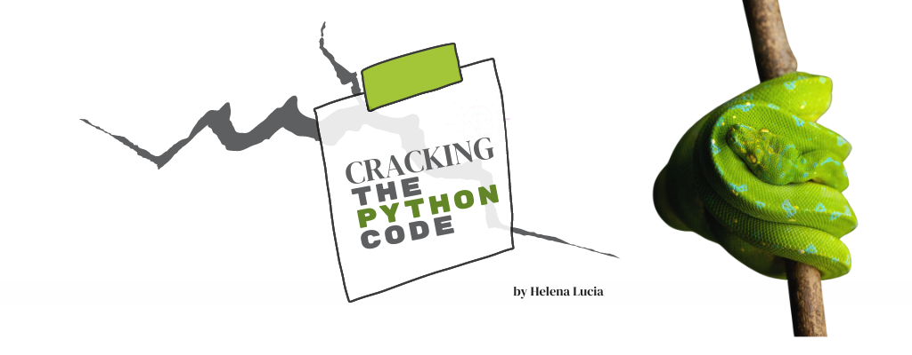

<a href="./README.md">
    About this Course
</a>

# Part 1: Persist Values Using Variables in Python

### Lesson 1: What is a variable?
This section is purely conceptual. The goal is to create associations to what you may know and remember. You will learn how to <b>conceptualize</b>, <b>declare</b>, and <b>assign</b> values to variables. In the next lesson, you will apply your knowledge and create variables in a Python notebook.
  
You are probably already familiar with the idea of <b>variables</b> 
from early mathematics.

Consider this right triangle. Let's dust off some of our knowledge. What do you remember about a right triangle? The two sides adjacent to the right angle are the <b><i>bases</i></b>, and the side opposite to the right angle is called the <b><i>hypotenuse</i></b>.

You may also remember that if you are given the length of two sides of a right triangle, you can use the following formula to calculate the third side.
 
<b>a2 + b2 = c2</b> where a and b are bases and c is the hypotenuse.
  
<b><i>If you didn't remember this formula, it's no problem. You can always use your search engine. Most programmers rapidly become experts at finding answers online. You will be encouraged to liberally search for information online, especially in later lessons. it will be a critical part of your workflow.</i></b>

Let's use the variable names <b>a, b, c</b> from our formula to denote the sides of the triangle.
  <i>We could use more descriptive variable names like <b>base_a</b>, <b>base_b</b>, and <b>hypotenuse_c</b> or even silly variable names like <b>fried_eggs</b>, <b>french_fries</b>, and <b>grilled_cheese_sandwich</b>. We did not get in the habit of creatively naming variables in math, perhaps because math homework is mostly handwritten. In programming, we want our code to be human-readable as well as machine-readable, so we will opt for more legible variable names than simply letters, but we will use single letter names for this example, for the sake of familiarity. </i>

 

Suppose you already know the values for <b>a</b> and <b>b</b>. We can isolate and solve for <b>unknown variable c</b> using the known formula <b>a2 + b2 = c2</b> like this:

Now we have a formula to solve for c. Since we already know the values for a and b, we want to ask the computer to solve for c.

 

<b>Let a = 3</b>
 
<b>Let b = 4</b>
 
<b>Therefore c = the square root of (32 + 42)</b>

<i>How would we do this in Python?</i> Please read through the following code, including the comments. A hashtag (#) comments out a line in Python. Throughout this course, you will be guided through comments, so please don't ignore them.

 
Our answer? <b>The variable c holds the value 5.</b> Notice in this step, we used the equation to solve for c, but what we really did is <b>declared</b> a variable <b>c</b>, <b>assigned</b> it the value of the square root of a-squared plus b-squared.
  
Perhaps you knew the answer would be 5. Why? 3-4-5 is a famous right triangle, so you may have had that information stored.
  

<b><i>Key Concepts:</i></b>
- <b>Variables</b> are used to store data, to be accessed later in our code, just as we declared and assigned values to variables in math.
- When defining variables, <b>=</b> (the equals sign) is called the <b>assignment operator</b>.
- In the above example, when we let `a = 3`, we <b>declared</b> `a` and <b>assigned</b> it a value of `3`. Some programming languages require declaration and assignment to be separate operations, but not Python.
- Variables can be redefined by overwriting the value, which is called <b>redeclaring</b>. Python will use whatever value was last declared.
### <b>Conclusion</b>
Just as you use variables to define values in math, you can use variables in programming to store information you want to use for later. In this case, we used a and b to calculate c, and stored all those values at locations a, b, and c.

You reached the end of the lesson!
<a href="./02_dos_and_donts.ipynb">
    Next: Dos and Don'ts with Variables.
</a>