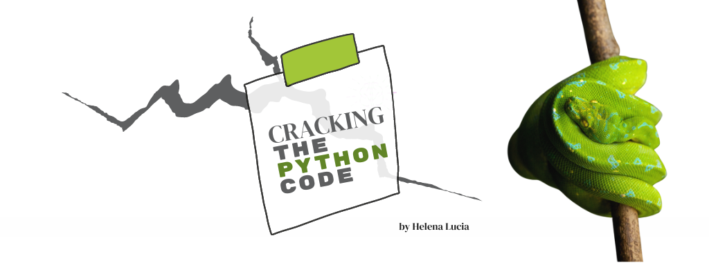

     

# About this Course

## Description
Finally, a programming course that meets you where you are, at the beginning. Perhaps you have tried learning Python, but the existing material goes so deep so fast and assumes certain knowledge. It's not a you problem.
 
In this course, you will learn to find the answers and reinforce your learning by appling knowledge immediately. The lessons are designed to work with how your brain works, layering knowledge through repitition on top of the things you already know. You will build confidence through immediate application, tacking concepts on top of existing knowledge. Ultimately, you will be confident using Python to solve the puzzles you need a computer to solve, enhancing your ability to solve problems.

## Methodology
- <b>Learn Through Association and Repetition.</b> Memory works like a network, we remember things by associating things to what we already know, and reinforce those neural pathways through repetition. This may feel redundant, but it is by design.
- <b>Conceptualize, Then Apply.</b> This course uses learning notebooks to ensure that you can immediately apply the concepts even before you have a local Python programming environment set up. This provides immediate feedback and reinforcement.
- <b>Build Momentum with Success.</b> Small, bite-sized lessons that grow in complexity provide confidence and build momentum.
- <b>Learn to Fish.</b> I'm sure you have heard the proverb, "If you give a person a fish, they eat for a day. If you teach them to fish, they eat for a lifetime." My goal is to teach you to fish. Many programmers are expert Googlers. In this course, I teach you how to use built-in help functions and search engine to find solutions when they are non-obvious.
- <b>Learn by Example.</b> This course provides examples that will help you conceptualize not only what you are doing, thereby creating associations to other problems you may be striving to solve.
- <b>Test-Inspired Development.</b> Building robust tests is a fine art and will save your bacon as a programmer. Testing is either central or forgotten in many courses. This course will start teaching you to test early and often, and take the guesswork out of writing tests.
- <b>Order Matters?</b> You will notice that the ordering in this course is not typical, you do not exactly learn concepts in a fixed order. You learn them as you would in life, on a need-to-know but I can find out the answer type of way.
- <b>Find Your Optimal Learning State.</b> The primitive part of our brain has two strong motivators: safety and reward. The safety pathway can take the rest of your brain offline under duress. If you don't have access to critical thinking, you will not learn to program. That is why the typical "hold you underwater until you learn how to swim" approach (like how I learned to program in college) creates dissonance and is extra difficult. It is important that you feel safe when you are trying to learn a new concept, so this course is designed to provide safety as a core piece of the learning process. 
- <b>Compassion-Focused.</b>  If you don't know something, it is just a learning opportunity and not an indictment on your intelligence. Snark and shame are not good motivators for anything, especially learning. You will not find that here.
- <b>Celebrate!</b> Hack that reward pathway! I know it feels cheesy, but at the very least, give yourself a compliment every time you finish a lesson, even if it felt easy. This really works!

## About Helena
As a single mom, Helena Lucia returned to college and completed a computer science degree Cum Laude. Early on, she noticed cracks in the system of teaching STEM concepts by "immersion through recursion". Drawing on her vast expertise in not only computer science and skills she has polished on her own journey, Helena combines all her superpowers to bring you a new kind of Python course. 

<a href="./01_variables.md">Get Started!</a>

